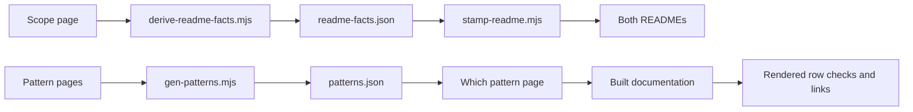

# Direction review — comprehensive ERP UI framework

User direction, 2026-09-20: a comprehensive UI framework for ERP applications, focused on simplification, scalability, high performance, easy use by AI coding agents, end-to-end delivery, and graph engineering.

## Verdict

Accept the direction. Make completeness mean supported ERP journeys and their failure states, rather than a component count. Keep the existing CSS-first, native-element, dependency-free core and application-owned business logic. The new direction does not by itself reverse specific decisions on drag engines, moving navigation, a JS component runtime, or the Screen Contract admission pilot.

## Challenge the prompt before building

| Ambiguity | Failure if left vague | Working interpretation and evidence |
| --- | --- | --- |
| Comprehensive | Endless feature collection, with shallow examples | Cover the existing six screen intents and their journey transitions; record loading, empty, error, permission and conflict states where applicable. Inventory gaps in real compositions before adding primitives. |
| Simple | Short docs hide complicated contracts | A change should remove consumer code or decisions. Measure the existing eight lookup tasks and the code needed to compose a working screen; fewer words alone are not success. |
| Scalable | A claim of unlimited rows or one layout on every device | Separate screen/data scale from maintenance scale. Use server pagination where appropriate, test dense tables and long labels, and verify shared components in independent compositions at desktop and narrow widths. |
| High performance | A small CSS bundle is treated as proof of fast interaction | Preserve the existing per-artifact and total size budgets. Measure rendering, select-all, style flush and subsequent interaction with the existing stress harness; record revision, environment, row counts and repeated samples. Fix correctness before timing it. |
| Easy for AI agents | More metadata is mistaken for better screen building | Give agents the existing shell → pattern → components → verify path. Judge generated screens on real APIs, states, accessibility and successful use, not on whether an agent liked the documentation. |
| End to end | A gallery demo is called a working ERP application | Verify installation into an independent consumer, composition, validation/error recovery, save/confirmation, and the next journey step. Use reference apps for data integration; the framework does not become the ERP business backend. |
| Graph engineering | A stale diagram or new database becomes another authority | Trace requirements to journeys, patterns, components, source, generated artifacts and checks. Verify edges against current source. Keep markdown/code authoritative and graph databases rebuildable. |

## What exists, and what is not proven

- `ROADMAP.md` has 33 open checkboxes at base `6b72a778`; Slice 373 is the latest owner-directed delivery sequence. Its 373.2–373.5 and 373.7 already cover much of this direction.
- The existing component/pattern manifests, generated docs, consumer markup validator, reference applications and browser checks are the foundation. Their presence alone does not prove a fresh agent can complete a real task.
- `112.3` already has the owner's four protocol decisions. Five real owner-written briefs are still absent; the brief file remains a scaffold. Do not replace those with agent-invented examples or count reference-app evidence as the sealed pilot.
- `graphify-out/graph.json` names `7ae2b5a6157c3e3690dbe4540a29bb9d20c2bb5b` as its build commit, while the current base is `6b72a7788260646cc44388f87551d8c42a7c7b93`. Its SQLite metadata records 2,273 nodes and 3,556 edges but no revision. It is stale evidence for the current change, not a valid impact oracle.
- Performance, accessibility and journey coverage beyond the first change remain to be measured. Previously recorded green results are historical, not a new certification.

## First verified dependency path: documentation truth, roadmap 373.2

These edges were checked by reading the current producers and consumers; they do not rely on the stale graph database.

Concrete defect: the pattern chooser reads generated pattern data but then re-parses opener prose using a narrower regular expression. This loses guidance that already exists as `wrongChoice.clause`. The repair removes that second interpretation and verifies every rendered row against the independently re-read manifest.

Other first-slice corrections: expose the already-shipped RF profile and App Launch pattern, distinguish a composed board from a drag engine, and state honestly that the markup checker skips escaped code samples. Generated README facts are refreshed through their producers.

## Delivery order and acceptance

1. **Truthful adoption guidance — 373.2.** Correct sources, regenerate derived documentation, reconcile every pattern row, and build the docs. No new runtime API or gate is needed.
2. **Dependable shell and interaction — 373.3/373.4.** Reproduce and fix clipping/obscured focus and removal focus loss. Validate keyboard behavior, mobile layouts and both themes with real browser events.
3. **Agent composition path — 373.7, then 373.5.** Improve the existing agent entry point and compose the launcher from existing pieces. Preserve the pilot boundary and document changes to its input.
4. **Journey and scale evidence.** Use existing consumer/ERP suite and stress harnesses; report observed gaps and measured limits. Include print issues 369.1/369.2 and independent dropzone review 373.10 in the acceptance work. Do not label a static screen or one benchmark an end-to-end pass.
5. **Evidence-gated expansion — 112.3 → conditionally 112.4.** Run the established pilot when real briefs arrive. Only confirmed failures justify more machine-readable contracts or tooling.

Before a cross-cutting change, refresh the existing graph with its supported producer or verify the relevant dependency path directly and say what was not covered. Never infer absent functionality from a missing node. No new graph service, schema or agent runtime is introduced in this slice.

## First checkpoint — local verification

373.2 is implemented and verified in the working tree, not committed or published.

- `npm run docs:build` passes its existing generator and validation chain.
- `npm run build` passes all core checks up to its final package check. That check initially failed on the sandboxed npm cache, then passed independently with `npm_config_cache=/private/tmp/boui-npm-cache npm run check:package -w @busy-office/ui` (185 tarball files). No global cache permissions were changed.
- Pattern choice was verified against independently re-read `patterns.json`: the former regex yields 34/39 populated clauses, and the built page now reproduces all 39 clauses under their correct pattern links. No new permanent gate was added.
- Five changed pages were served from fresh dist, with served HTML compared byte-for-byte to disk. Content assertions and screenshots cover 1440px and 390px in light and dark: 20 passing cases. Several screenshots were visually inspected, including the chooser, RF instructions, scope and shell templates. The running Podman preview was not replaced; screenshots use the project's existing `serveDist`/browser harness against fresh local dist.
- `npm run check:layout -w docs` passes across 128 pages: narrow viewport, 150% zoom, text-spacing overrides and styled-link checks. This is the shell-aware layout gate; the narrower content probe's document-width reading is not used as proof of shell layout.
- Temporary probe and evidence: `/private/tmp/boui-3732-verify.mjs`, `/private/tmp/boui-3732-evidence/results.json`, and screenshots alongside that file. These are local inspection artifacts, not persistent test infrastructure.
- The installed `graphify update` producer refreshed code extraction: 6,313 nodes and 8,067 edges, with base revision `6b72a778`. It preserved historical semantic/doc nodes, so this is not a fresh semantic review. Its JSON update did not update SQLite; the existing `json_to_sqlite.py` producer was run separately. An independent JSON reread reconciled exact node identity sets and edge tuples with multiplicities against SQL, rather than trusting metadata counts. Both outputs remain git-ignored. Previous graph copies were preserved before refresh.
- The original graph's document edges and the latest uncommitted prose must still be checked directly. A graph stamped with HEAD is not proof that it captures all working-tree changes or all semantics.

Next ready item is 373.3. Performance stress measurements, the full consumer journey run, and the sealed agent pilot are pending; none is claimed complete by these documentation checks.

## Refused interpretations

- “Comprehensive” means every UI widget or a replacement for application state, business rules, security enforcement, routing, or backend services.
- “Graph engineering” requires a runtime graph service, a second task system, or manually duplicated component metadata.
- “AI-friendly” permits an invented API or a screen with unverified save/error behavior.
- “High performance” is satisfied by bundle size alone or by timings that do not verify the operation happened.

The first checkpoint is a local verified change, not a release. Publishing remains owner-triggered. Results are recorded in the existing roadmap item after checks finish.
